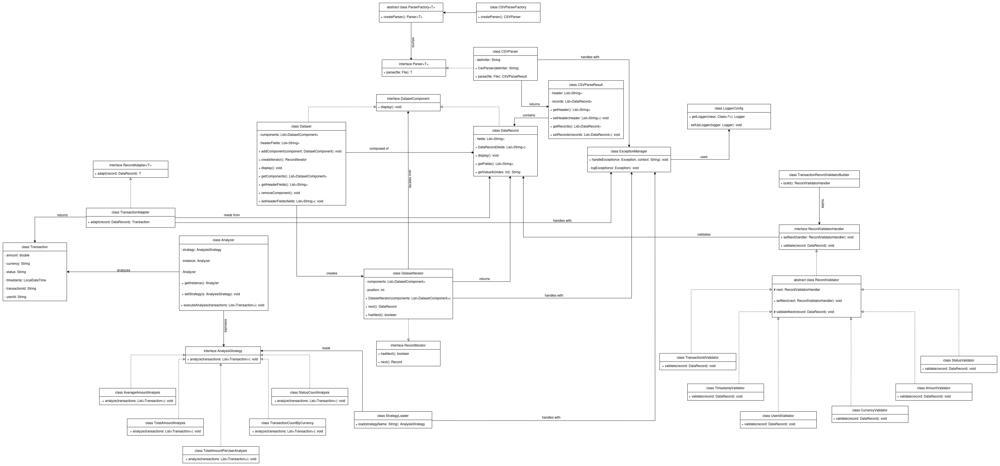
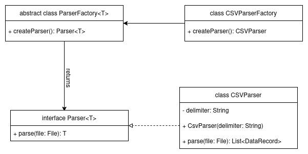

# 📊 CSV Data Analyzer

**CSV Data Analyzer** is a Java-based application designed to parse, validate, transform, and analyze tabular data from CSV files using a clean, extensible, and object-oriented architecture. It provides a user-friendly CLI interface for selecting and executing analysis strategies, with results displayed directly in the console.
The project is structured around well-established **software design patterns** and focuses on **modularity, separation of concerns**, and **robust exception and validation handling**.

---

## 📐 Project UML Diagram


---

## 📁 Project Structure

```plaintext
src/
└── main/java/it/emanuelebachetti/csvdataanalyzer/
    ├─ analysis/         # Analysis strategies and dynamic loading
    ├─ cli/              # CLI interface for interactive analysis
    ├─ exception/        # Centralized exception handling (Exception Shielding)
    ├─ iterator/         # Iterator Pattern for Composite structure
    ├─ logging/          # Logger configuration for console and file output
    ├─ model/
    │   ├─ adapter/      # Adapter pattern for transforming DataRecord to Transaction
    │   └─ transaction/  # Transaction domain model
    ├─ parser/
    │   ├─ CSV/          # CSV parsing and structure validators
    │   └─ factory/      # Factory Method for parser instantiation
    ├─ validator/        # Chain of Responsibility for record-level validation
    └─ App.java          # Main entry point
```

---

## ✅ Features

- ✅ CSV file parsing using a flexible factory-based architecture
- ✅ Structured data organization and representation with the Composite pattern
- ✅ Manual Iterator for accessing dataset records
- ✅ Statistical and domain-specific analysis using the Strategy pattern
- ✅ Exception shielding and logging of all critical errors (console and file)
- ✅ Centralized validation of CSV structure and content using Chain of Responsibility
- ✅ Support for field transformation via Adapter pattern
- ✅ Dynamic loading of strategies using Reflection
- ✅ CLI interface for analysis selection and execution

---

## 💡 Design Patterns Used

### Factory Method Pattern
- **Classes**: `ParserFactory`, `Parser<T>`, `CSVParser`, `CSVParserFactory`
- **Purpose**: Creates parsers based on data file type. Allows to avoid complex logical expressions (e.g switch-case or if-else statements) mantaining Open/Closed principle. Designed to be extensible to `json`, `xml`, etc.



### Composite Pattern
- **Interface**: `DatasetComponent`
- **Leaf**: `DataRecord`
- **Composite**: `Dataset`
- **Purpose**: Stores CSV rows. Treats single records and record groups uniformly. Displays records in the console.


### Iterator Pattern (Manual)
- **Interface**: `RecordIterator`
- **Implementation**: `DatasetIterator`
- **Purpose**: Iterates through the components of `Dataset`, providing sequential access while hiding its internal structure and implementation details.


### Exception Shielding Pattern
- **Class**: `ExceptionManager`
- **Purpose**: Logs critical internal errors and rethrows generic messages to shield internal program logic from the user.


### Strategy Pattern
- **Interface**: `AnalysisStrategy`
- **Implementations**: `TotalAmountAnalysis`, `AverageAmountAnalysis`, etc.
- **Purpose**: Enables flexible choice and execution of analysis at runtime, avoiding complex conditional logic and promoting extensibility for adding new analysis strategies.


### Chain of Responsibility
- **Handlers**: `RecordValidatorHandler` and all concrete validators (`TransactionIdValidator`, `AmountValidator`, etc.)
- **Purpose**: Composable and extendable record-level validation logic, allowing dynamic chaining of validators to handle complex validation scenarios while maintaining modularity and separation of concerns.


### Adapter Pattern
- **Adapters**: `TransactionAdapter`, `RecordAdapter`
- **Purpose**: Converts `DataRecord` into typed `Transaction` objects, enabling seamless integration between components that use different interfaces.


### Singleton
- **Class**: `Analyzer`
- **Purpose**: Ensures that a single `Analyzer` instance is created and used during runtime, providing centralized control and preventing redundant instantiations.


--- 

## Technologies Used

- **Java Collections Framework** – Used for dynamic data storage (`List`, `Map`, etc.).
- **Generics** – Ensures type safety and flexibility in interfaces like `Parser`<T>.
- **Java I/O** – Core file reading/writing functionalities for parsing CSV files.
- **Logging (java.util.logging)** – Logs errors to both console and file with configurable levels.
- **Stream API & Lambdas** – Used in analysis strategies for data aggregation and filtering.
- **Reflection** – Enables dynamic strategy loading at runtime based on user input.
- **JUnit** – Unit testing framework used to verify the correctness of business logic and application components through automated tests.
- **Mockito** – Used for mocking dependencies in some test cases.
- **Inversion of Control** – Promotes loose coupling (decoupling the creation and selection of analysis strategies from their execution context) by delegating the decision of which strategy to use to the consuming component (e.g., `AnalysisCLI`), rather than hardcoding dependencies.

---

## 📋 Requirements

- Java 21 or higher;
- Maven 3.8.1 or higher;

## ⚙️ How to Run

1. Clone the repository:

```bash
git clone https://github.com/baketti/CSVDataAnalyzer.git 
cd CSVDataAnalyzer
```

2. Compile the project using Maven:
```bash 
mvn clean compile
```

3. Run the application using Maven:
```bash 
mvn exec:java -Dexec.mainClass="it.emanuelebachetti.csvdataanalyzer.App"
```

---

## 🧪 How to Run Tests

To execute the tests, use the following Maven command:
```bash 
mvn test
```
This will run all the tests in the `src/test/java` directory using JUnit 5.

---

## Known Limitations and Future Work

### Known Limitations

- **CSV-only Support**: The application currently only supports CSV files. It cannot parse or analyze data from other formats such as JSON or XML.
- **Strict CSV Structure**: The CSV input must strictly follow a predefined schema, with required headers such as `transaction_id`, `timestamp`, `user_id`, etc. If the structure does not match, the CSV document is considered invalid and the program stops its execution.
- **Fixed Dataset**: Users cannot upload or select custom CSV files at runtime. The application only operates on a hardcoded file path embedded in the codebase.
- **Basic Analytics**: The current analysis strategies are minimal and intended for demonstration purposes only. There is no support for advanced filtering, custom queries, or data visualization.

### Future Work

- **Multi-format Support**: Extend the parser system to handle additional formats (e.g., JSON, XML) using the existing factory architecture.
- **User-driven Input**: Allow users to select and upload CSV files dynamically via CLI or GUI interface.
- **Advanced Analytics**: Incorporate more complex statistical computations and visualizations.
- **Improved User Interaction**: Introduce filtering options, pagination, and querying capabilities to let users choose what data to view and how to analyze it.
